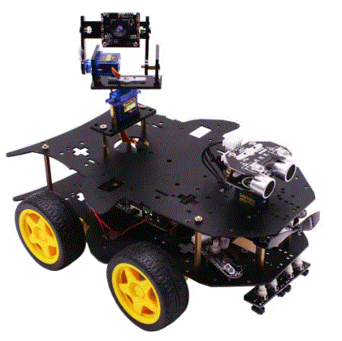

# OpenCvを使用した顔画像認識とストリーミングWeb配信(Django)
カメラ(WindowsノートPCのカメラ)でリアルタイム動画を撮影しつつ、Djangoフレームワークでストリーム配信を行った。

## 目的
別途行っているミニ四駆ラジコン化計画に向け、車載カメラによる撮影と、画像認識技術を使用したカメラ向きの自動補正(顔認識枠が常にカメラ中心点に収まるよう、カメラ制御サーボを動かす)が行えるようにすること(↓こんなふうにしたい)

## 結果

## おおよその作り
 - Python DjangoフレームワークでWebサーバを起動
 - 土台となる index.html を配信し、その中にIFRAMEタグでキャプチャ動画を表示する領域を配置。
 - キャプチャ領域にDjangoテンプレート変数を設定して別途サーバリクエストを行わせ、ルーティング参照先(Viesw.Capture())でStreamingHttpResponse()を使用して、動画を配信。
 - 動画といっても、実態はカメラから取得した1フレームずつの静止画を、パラパラ漫画の要領で無限ループしつつ送信している（よって、音声は配信できていない）

## 所要
 - 1日程度

## 苦労話
 - ググると、以下の情報は個々に散見されたが、合わさったものが見つからなかった。
   - OepnCvを使用した動画撮影
   - OpenCvを使用した顔画像認識と白枠表示
   - ストリーミング配信

## 残課題
 - カスケード分類器についてはおおよその理解。3,000枚ほどの静止画があれば、個別の分類器も簡単に作れそうだ(今回はやるつもりはないが)
 - 今回の方法ではT/F(人か、人以外か)の認識しか必要としないが、AI画像認識で行われる各個要素の認識をどうやるのか知りたい(たとえば、商品展にカメラを向けるとリンゴとバナナとパイナップルを別々に識別するとか。まさか、それぞれの分類器分、メソッドを繰り返すのか？)
 - PythonにおけるYeildの処理内容と、DjangoのStreamingHttpResponse()の実行内容について、よくわかっていない。
 - 今回はWindows上で実施したが、RaspberryPi(Raspbian)とPiCameraで実現する必要あり。単純に移したところ、OpenCvライブラリの起動で落ちる。原因調査中。
 